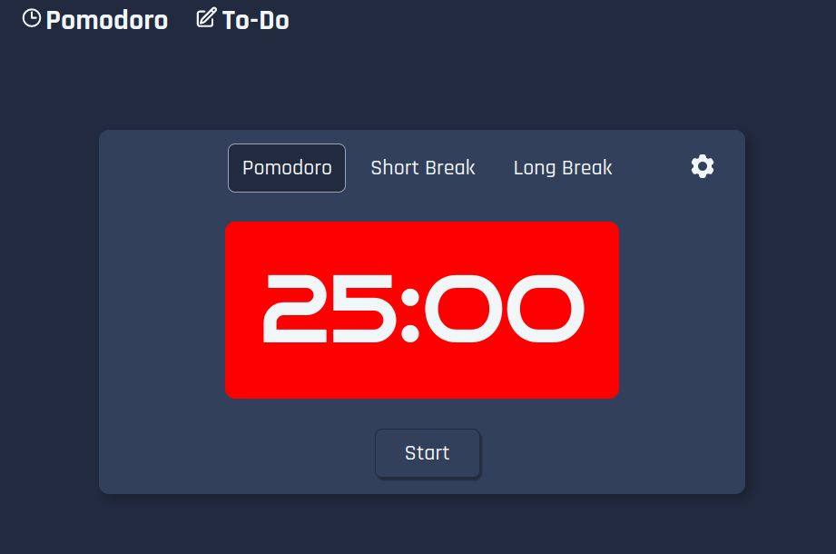
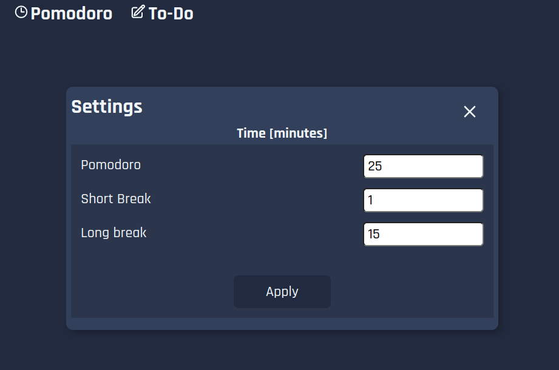
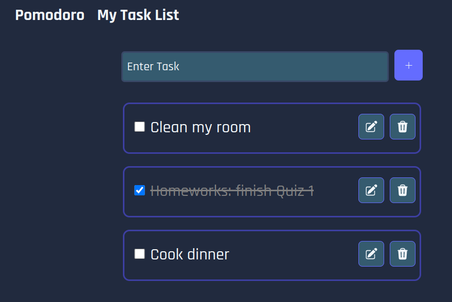
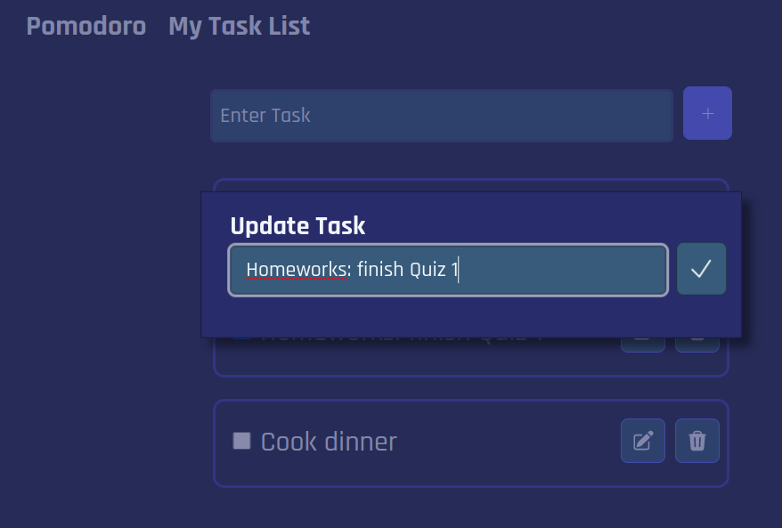

# Pomodoro-Todo Timer

URL: https://melodic-quokka-c2d064.netlify.app/

A timer for the Pomodoro technique that includes a to-do list feature.

## Technologies

### Front-End

- HTML, CSS, and React JS
- React Router v6
- Hero Icons - for svg/png icons

### Deployment

- Deployment through Netlify

## How to use the app

You can choose from three timer modes: pomodoro, short break, and long break. To start the timer, click the **Start** button; by default, the timer is set to pomodoro mode. The settings menu button opens the settings page.

